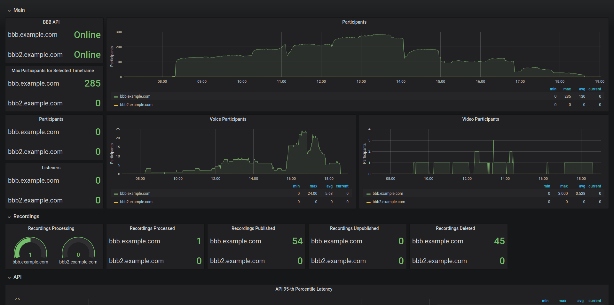
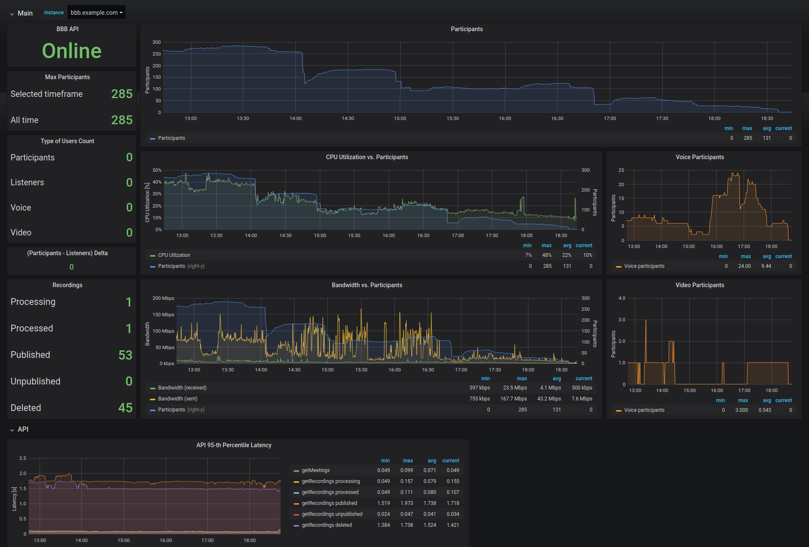

# BigBlueButton Exporter
Prometheus exporter for BigBlueButton.
On a HTTP `/metrics` request, the exporter will query the BigBlueButton's API for data which it then aggregates and exposes as metrics.

Docker container image: [https://hub.docker.com/r/greenstatic/bigbluebutton-exporter](https://hub.docker.com/r/greenstatic/bigbluebutton-exporter)

Default port: 9688

## Documentation
Available at: [https://bigbluebutton-exporter.greenstatic.dev](https://bigbluebutton-exporter.greenstatic.dev)

## Grafana Dashboard Screenshot

## Metrics
See: [Exporter User Guide - Metrics](https://bigbluebutton-exporter.greenstatic.dev/exporter-user-guide/#metrics).

## Environment Variables
See: [Exporter User Guide - Environment Variables](https://bigbluebutton-exporter.greenstatic.dev/exporter-user-guide/#environment-variables).
